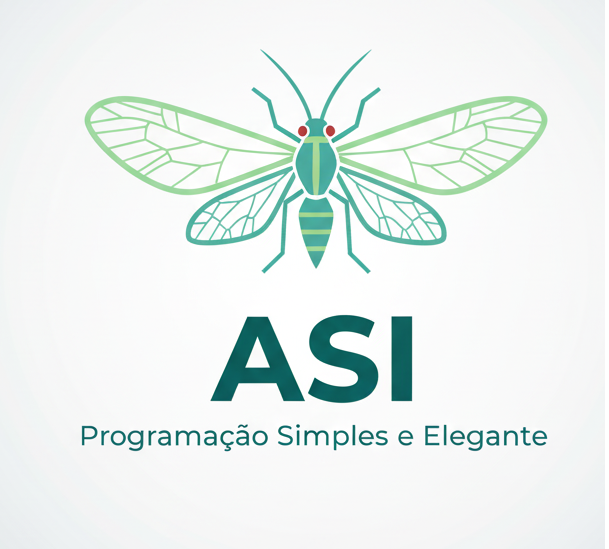

 <!-- Imagem com largura definida -->

Compilador para a Linguagem ASI

Este projeto é um trabalho acadêmico para a disciplina de Compiladores, consistindo na criação de um compilador (tradutor) para uma linguagem de brinquedo chamada ASI.

O compilador é escrito em Python e traduz o código-fonte .asi para código C.

Equipe (Trabalho Acadêmico)

Disciplina: Compiladores

Professor: Maurício Rodrigues Lima

Alunos:

Carlos Eduardo

Diony Tarso Ferreira Filho

Gabriel Jonas Lucio

Manel

Sergio Filho

Sobre a Linguagem ASI

ASI é uma linguagem de programação imperativa simples, com sintaxe em português.

Funcionalidades Implementadas

O compilador ASI atualmente suporta as seguintes funcionalidades:

1. Tipos de Dados:

inteiro (traduzido para int)

decimal (traduzido para float)

duplo (traduzido para double)

caractere (traduzido para char)

booleano (traduzido para bool, com literais verdadeiro e falso)

texto (traduzido para const char*)

2. Estruturas de Dados:

Vetores (Arrays): Declaração de vetores unidimensionais (ex: meu_vetor.inteiro[10];).

Matrizes (Arrays 2D+): Declaração de matrizes multidimensionais (ex: mapa.caractere[5][5];).

Acesso: Acesso a índices de vetores e matrizes (ex: meu_vetor[0] = 5;).

3. Estruturas de Controle (100% Funcionais):

Seleção (If/Else): se (condicao) { ... } eSe { ... }

Repetição (While): ateQue (condicao) { ... }

Repetição (For): ate (inicializacao; condicao; incremento) { ... }

4. Operações e Expressões:

Operadores aritméticos (+, -, *, /) com precedência correta.

Operadores relacionais (>, <, ==, !=, etc.).

Operações com Booleanos: A linguagem trata verdadeiro como 1 e falso como 0 em operações aritméticas (ex: verdadeiro + 5 resulta em 6).

5. Funções Nativas:

escreva(...): Traduzida para printf em C, com suporte básico para strings e variáveis.

copiar_texto(destino, origem): Traduzida para strcpy em C.

6. Gerenciamento de Memória (Discussão):

A linguagem introduz deliberadamente o problema de Buffer Overflow através da função copiar_texto (que usa strcpy) como um ponto de discussão para o seminário.

Como Executar o Compilador

Requisitos:

Python 3.x

Um compilador C (como gcc ou clang) instalado no sistema.

Arquivos do Projeto:

lexer.py: O analisador léxico (tokenizador).

parser.py: O analisador sintático (construtor da AST).

code_generator.py: O gerador de código C.

main.py: O orquestrador principal do compilador.

teste.asi: Um arquivo de exemplo com código-fonte na linguagem ASI.

Passos para Execução:

Executar o Compilador (Tradução):
No terminal, execute o arquivo main.py.

python main.py

Isso irá ler o arquivo teste.asi, processá-lo e gerar um novo arquivo chamado teste.c.

Compilar o Código C Gerado:
Use o seu compilador C (ex: gcc) para compilar o arquivo de saída.

gcc teste.c -o saida

Executar o Programa Final:
Execute o programa compilado.

./saida
